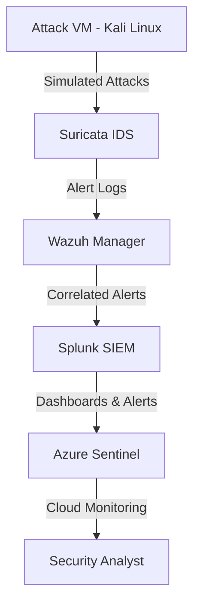

# 🛡️ SOC-Focused Home Lab

A hands-on **Security Operations Center (SOC)** lab designed to simulate real-world threat detection, monitoring, and incident response workflows.  
This project showcases the integration of multiple security tools like **Suricata, Splunk, Azure Sentinel, Wireshark, and Wazuh** to build a detection and response pipeline.

---

## 🎯 Objectives
- Build a SOC-focused homelab environment for practicing detection, response, and analysis.
- Simulate attacks and monitor them using enterprise-grade SIEM and IDS solutions.
- Develop and fine-tune detection rules, dashboards, and alerts.
- Gain hands-on experience in log collection, correlation, and threat hunting.

---

## 🛠️ Tools & Technologies
| Tool / Platform          | Purpose |
|--------------------------|---------|
| **Suricata**             | Network intrusion detection & traffic monitoring |
| **Splunk**               | SIEM platform for log aggregation & alerting |
| **Azure Sentinel**       | Cloud-native SIEM for threat detection & investigation |
| **Wireshark**            | Deep packet inspection and traffic analysis |
| **Wazuh**                | Endpoint security, log analysis, and SIEM integration |
| **Kali Linux / Attack VM**| Attack simulation and testing detection workflows |

---

## 🔍 Key Features

- 🛡️ **Intrusion Detection with Suricata**
  - Configured Suricata as an IDS/IPS to monitor network traffic.
  - Created custom detection rules for brute-force attacks, port scans, and malware traffic.

- 📊 **Centralized Log Aggregation with Splunk**
  - Forwarded Suricata and Wazuh logs to Splunk for real-time alerting.
  - Built dashboards to visualize attack patterns and incidents.

- ☁️ **Cloud SIEM with Azure Sentinel**
  - Integrated Azure Sentinel with on-prem logs for hybrid SOC visibility.
  - Created KQL queries for proactive threat hunting.

- 🔎 **Deep Packet Inspection with Wireshark**
  - Analyzed PCAP files to identify malicious payloads and verify alerts.

- 🖥️ **Endpoint Security with Wazuh**
  - Deployed Wazuh agents on multiple endpoints for log monitoring and threat detection.

------

## 🧩 Lab Architecture


```
Directory Structure:
SOC-Homelab/
├── SPLUNK-SETUP.md
├── SURICATA-SETUP.md
├── WAZUH_SETUP.md
└── configs/
```

- **SPLUNK-SETUP.md** → Complete guide to install, configure, and use Splunk for log aggregation and dashboards.  
- **SURICATA-SETUP.md** → Step-by-step instructions to set up Suricata IDS for network traffic monitoring and alerting.  
- **WAZUH_SETUP.md** → Instructions to deploy Wazuh for endpoint monitoring, log analysis, and integration with Splunk/Azure Sentinel.  
- **configs/** → Folder to store any configuration files for Splunk, Suricata, Wazuh, or other lab components.


##🙏 Thank You
```
Thank you for exploring this SOC-focused homelab!
I will try to update this project, if a major change occur. Feel free to customized this setup in your own way.
If you need any help or have questions, contact me:
LinkedIn: https://www.linkedin.com/in/amit29533/
Email: amit29533@gmail.com
```

